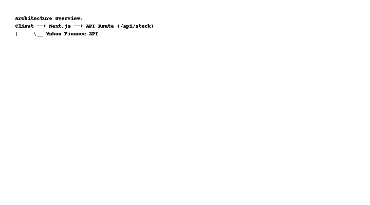
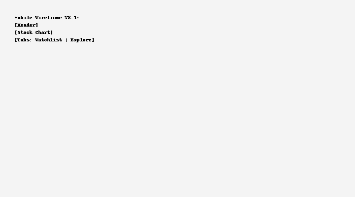

# Stock Tracker Web App

A full-featured stock tracking app with technical indicators, user watchlist, and real-time updates.

## Features
- Real-time stock price API
- Technical indicators: MA5, MA20, MACD
- Mobile responsive layout
- Future: login, personalized watchlist, financial reports

## Getting Started

```bash
npm install
npm run dev
```

## Folder Structure
```
- pages/
  - index.js
  - _app.js
  - api/
      - stock.js
- components/
- data/
- styles/
```

## 系統架構簡介



## 手機 UI 畫面草稿（V3.1）



## Author
Matt（可靠度工程師 / 技術投資分析者）
